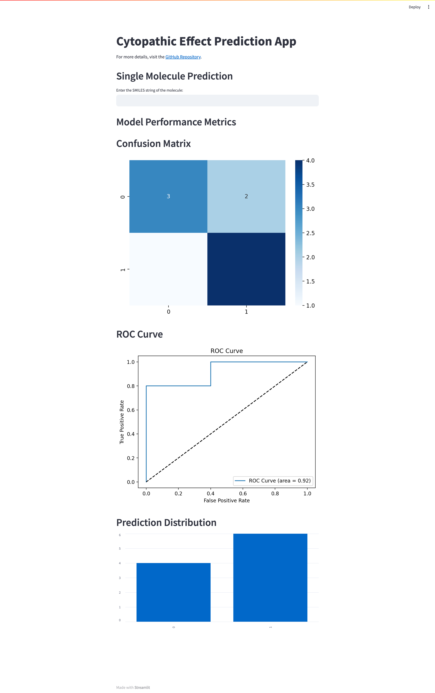

# Cytopathic Effect Prediction App

## Project Overview
This project is a machine learning application built to predict the cytopathic effect based on its **SMILES** representation. The machine learning model used is a **RandomForestClassifier**, which has been trained on molecular fingerprint data derived from SMILES strings. The project includes both model training and a user-friendly **Streamlit** app to make predictions on new molecules and visualize the model's performance metrics.

For more details, visit the [GitHub Repository](https://github.com/suhaasteja/COVID-19-Drug-Discovery).



## Technologies Used
- **RDKit**: To convert molecular SMILES strings into fingerprints.
- **Scikit-learn**: To train the Random Forest model and evaluate performance metrics.
- **Imbalanced-learn**: To balance the dataset using SMOTE (Synthetic Minority Over-sampling Technique).
- **Joblib**: To save and load the model and scaler.
- **Streamlit**: To build an interactive web app for predictions and model performance visualization.

## Model Training Process
1. **Data Preparation**: 
   - The SMILES strings are converted into molecular fingerprints using **RDKit**.
   - The dataset is balanced using **SMOTE** to handle any class imbalance.
   - The data is split into training and test sets.
   - The training data is scaled using **StandardScaler**.
   
2. **Model Training**: 
   - A **RandomForestClassifier** is trained on the scaled training data.
   - The model and the scaler are saved using **Joblib** for future use.

3. **Model Evaluation**:
   - The model's accuracy is calculated on the test set.
   - A classification report is generated to summarize performance metrics such as precision, recall, and F1-score.

## Streamlit App Features
The **Streamlit** app provides the following functionalities:

### 1. **Single Molecule Prediction**:
   - **Input**: A **SMILES** string representing a molecule (e.g., "CCO" for ethanol).
   - **Output**: The prediction of whether the molecule has a cytopathic effect (active or inactive) and the probability score of the prediction.

### 2. **Model Performance Metrics**:
   The app visualizes key performance metrics based on test data. This includes:
   
   - **Confusion Matrix**: A matrix displaying the number of true positive, true negative, false positive, and false negative predictions.
   - **ROC Curve**: A graph showing the trade-off between sensitivity (true positive rate) and specificity (false positive rate). The ROC-AUC score is also displayed.
   - **Prediction Distribution**: A bar chart showing the distribution of predicted classes (active/inactive).

## Input and Output

### Input
- **Single Molecule Prediction**: The app requires a **SMILES** string as input in the text box. Example:
   - `C1=CC=CC=C1` (Benzene)
   - `CCO` (Ethanol)

### Output
- The output of the app includes:
   - A prediction of whether the molecule has a **cytopathic effect** (active or inactive).
   - The **probability** associated with the prediction (e.g., 0.75 for a 75% chance that the molecule is active).
   - Visualizations such as confusion matrix, ROC curve, and prediction distribution.

## How to Run
1. **Install dependencies**:
   Run the following commands to install the necessary packages:
   ```bash
   pip install rdkit-pypi scikit-learn joblib imbalanced-learn streamlit
